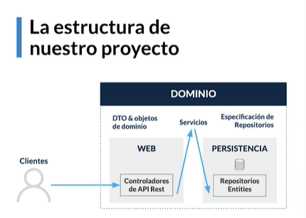
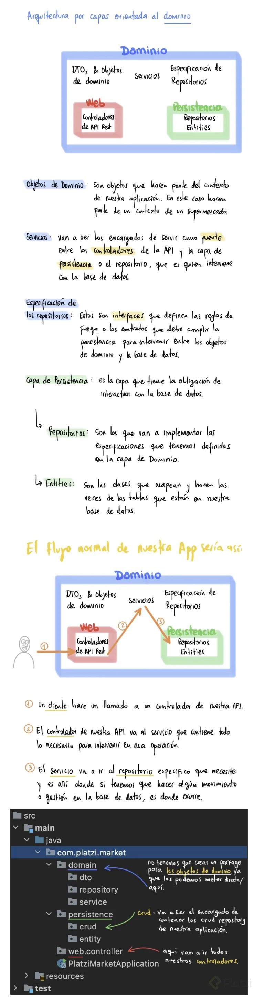
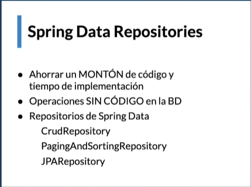
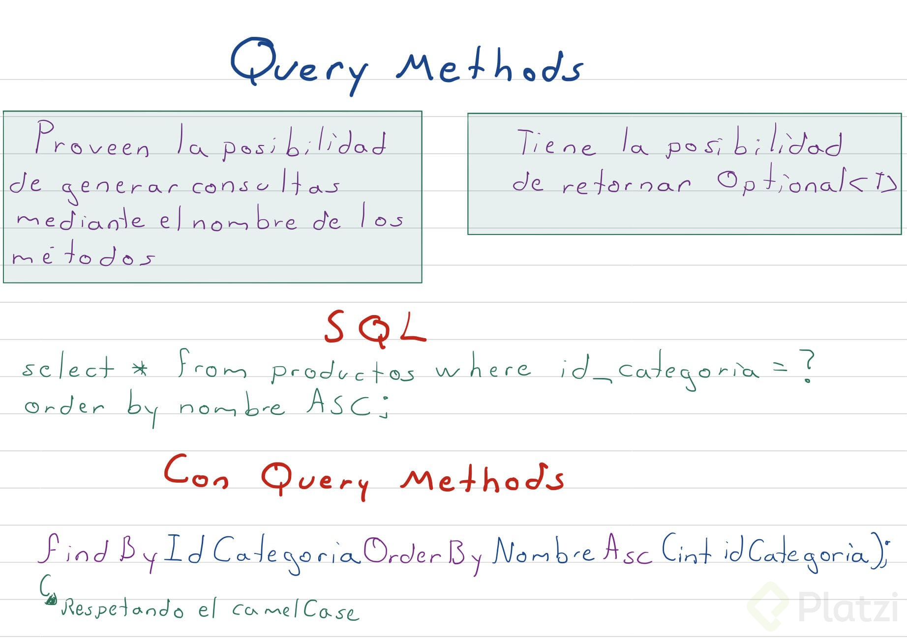

# Iniciando con Spring Boot
https://spring.io/projects/spring-framework
Spring es el framework más usado de Java. Nos ofrece herramientas que nos permite crear proyectos más avanzados, con mejores prácticas y en menor tiempo. También posee una gran comunidad, lo que nos brinda muchísima documentación y ayuda. Spring tiene una estructura modular y flexible, lo que nos hace usar solo lo que necesitemos.

1- Spring Framework: Permite crear aplicaciones empresariales modernas, es transversal a todos los demás, por que internamente todos lo usan.

2- Spring Boot: Es el proyecto de Spring que permite la creación de aplicaciones autocontenidas y auto configurables.

3- Spring Data JPA: Spring Data es el proyecto que resulto del esfuerzo de Spring para gestionar e integrar bases de datos con las aplicaciones.
Es un proyecto que internamente, tiene otros sub proyectos para hacer la conexión a bases de datos especificas, para este caso JPA.
Hay otros sub proyectos de Spring Data como son Spring Data Cassandra o Spring Data MongoDB, que son Bases de Datos NoSQL.

4- Spring Security: Con este se va a gestionar toda la seguridad de la aplicación: Autenticación, Autorización y Gestión de Seguridad.
Posee gran configurabilidad y también, varios métodos de protección anti ataques.

# Estructura del proyecto DDD (Arquitectura por capas orientada al dominio)
https://medium.com/@jonathanloscalzo/domain-driven-design-principios-beneficios-y-elementos-primera-parte-aad90f30aa35

La estructura del proyecto será de la siguiente manera:

1. DOMINIO:

DTO y objetos del dominio (Contexto de la aplicación)
Servicios: Puente entre los controladores y la capa de persistencia.
Especificación de repositorios: Interfaces que determinan las reglas que debe cumplir la persistencia para actuar entre los objetos de dominio y la DB.
2. WEB:

Controladores de API Rest.
3. PERSISTENCIA:

Repositorios: Implementan las especificaciones que tiene la capa de DOMINIO.
Entities: Mapean y actúan como tablas de la DB.

# Modelo de datos a usar

# Spring Data Repositories
Tres tipos de repositorios:
* CrudRepository: realizar el crud
* PagingAndSortingRepository: incluye lo de Crud repository además de paginación y ordenamiento.
* JpaRepository: Ademas de tener CrudRepository y PagingAndSortingRepository nos permite tareas específicas como Flush.

# Query Methods

