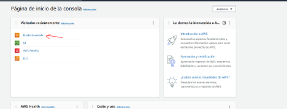
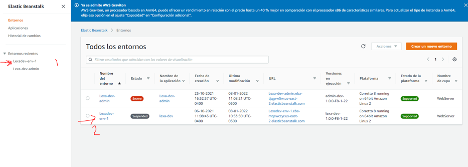
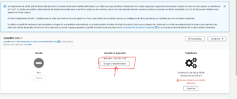
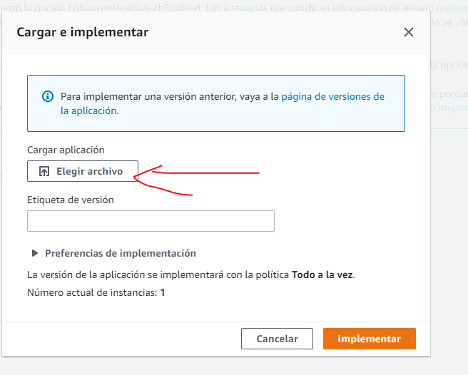
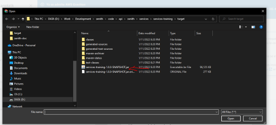
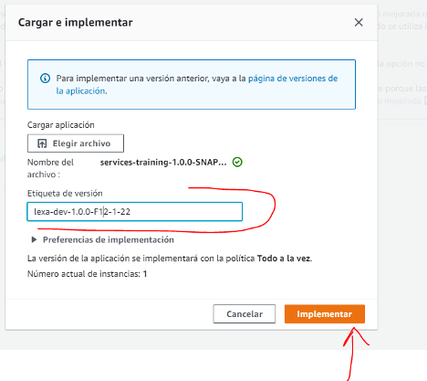

## Deploy de los Ambientes

### Si hay cambios en los .sql

<b>Importante</b>: Si se modificaron los schema.sql o data.sql existentes es necesario borrar el schema de la bd para
que al correr flyway no de error.

Para borrar el schema training de la BD correr ejecutar el siguiente comando en la consola de postgres

```
drop schema training cascade; 
```

### Prepararnos para el deploy

1. Hacer pull de la rama develop.
2. Generar el jar con el comando

```
mvn clean install -DskipTests
```

3. Entrar a la consola de administrativa de AWS https://us-east-2.console.aws.amazon.com/console/home?region=us-east-2#

```
User: zenith.devops@gmail.com
Password: Zenith2021#
```









Seleccionar el jar:





Ya esperar a que termine y listo.

<b>Nota:</b> Despues del deploy la app demora comom 1 minuto para funcionar

