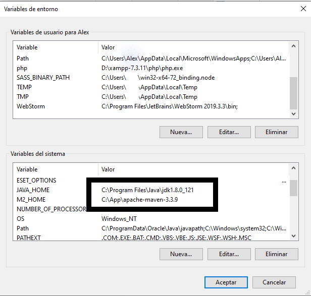
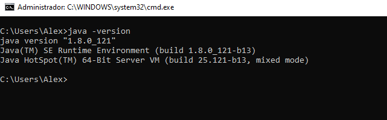
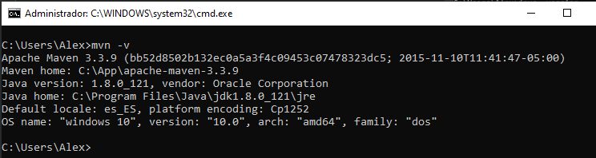
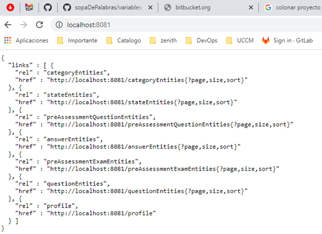

#Run Zenith API code in Windows environments

## 1- Download necessary tools
First, we download and install the Java JDK and Maven. Indispensable for the operation of the system.
*   JDK de Java

    - We downloaded the latest version of the Java JDK (almost 1.8.0_121 for me)
    - We follow the assistant until the end ...: next, next, next ...
    - We configure the Windows environment variables. (See point 2)
    
* Maven
    
    - We access the Maven website and download the latest version. (In my case, 3.3.9).
    - Unzip the file in C: / maven, so that all Maven files will be found in C: /maven/apache-maven-3.3.9 (in my case it is in another directory)
    - We configure the environment variable. (See point 2)
    
##2- Configuration of environment variables. 

* Java
    - Right click on Computer -> Properties -> Advanced system settings -> Advanced options tab -> Environment variables -> New      
      
      And we add
      
      Variable: **JAVA_HOME**
      
      Value: **C:/Program File/Java/jdk1.8.0_121** (or the address where you have installed the VM)
      
* Maven
    - Right click on Computer -> Properties -> Advanced system settings -> Advanced options tab -> Environment variables -> New
      
      And we add
      
      Variable: **M2_HOME**
      
      Value: **C:/maven/apache-maven-3.3.9** (or the address where you have copied or installed the maven)
      
    **Ejemplo de variables de entorno:**
    
    
    
##3- Checking that Java and Maven are working correctly
To check that everything has gone well we open a terminal and write:

For the case of java: **java -version** and we should see something like the following

   
   
For the case of maven: **mvn -v** and we should see something like the following

   
   
##4-	Downloading the bitbucket repository
In the terminal or in a git client we do not place in the address where we want to have our project and we clone it with the following command
```
git clone https://zenithsoftwaresolutions@bitbucket.org/zenithsoftwaresolutions/zenith.git
```   

##5- Installing necessary dependencies
After downloading the project we have to download and install the necessary dependencies, for this, from the terminal we do not place in the main directory and execute the command:
```
mvn clean install
```
##6- Running the project
After the necessary dependencies have been installed, we can only start the project with the following command
```
web java -jar SPRING_PROFILES_ACTIVE=local services/services-training/target/services-training-1.0.0-SNAPSHOT.jar 
```

##7- All OK
If everything has gone well when finishing lifting the project if we open a browser the url 
```
http://localhost:8081 
```
we should see something like the following



   


          
