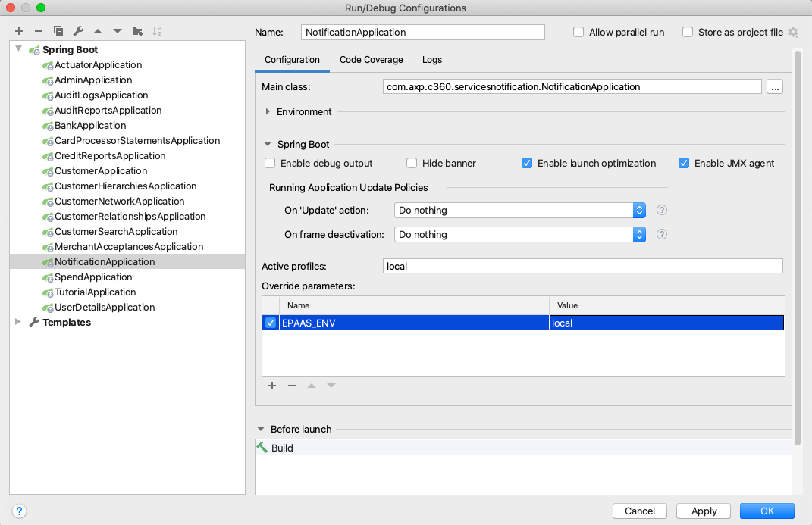

# Onboarding
## Getting Started

- [Architecture Overview](../../../Downloads/archive%20(3)/Architecture-Overview.md)
- [Good Practices and Standards](../../../Downloads/archive%20(3)/Good-Practices-and-Standards.md)
- [Plugins](../../../Downloads/archive%20(3)/Plugins.md)

### Prerequisites

Please install this in your local:
- Git
- IntelliJ Idea
- Maven

### Setting up development environment
1. Copy [settings.xml](resources/settings.xml) file from [resources](resources) folder to /Users/\<username>/.m2/ folder.

2. Clone project to desire location
    
    `git clone https://stash.aexp.com/stash/scm/aim500000694/customer360.git`

3. Using IntelliJ Idea locate and import mvn project

4. Execute mvn command from management-root folder:
    `mvn clean install`

5. Set environment variable ACTIVES_PROFILE_ACTIVE = local at desired service configuration:
    

6. Import Postman collections and environments from [postman](../services/services-base-test/src/test/resources/postman-collections) folder to execute test requests
