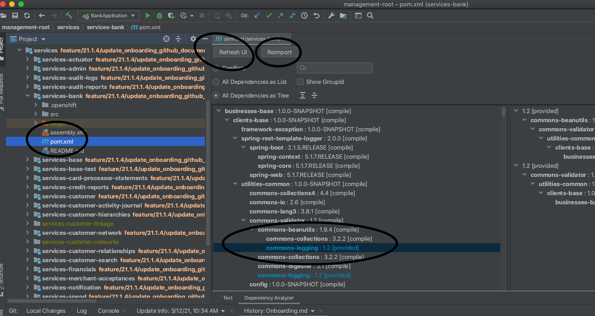
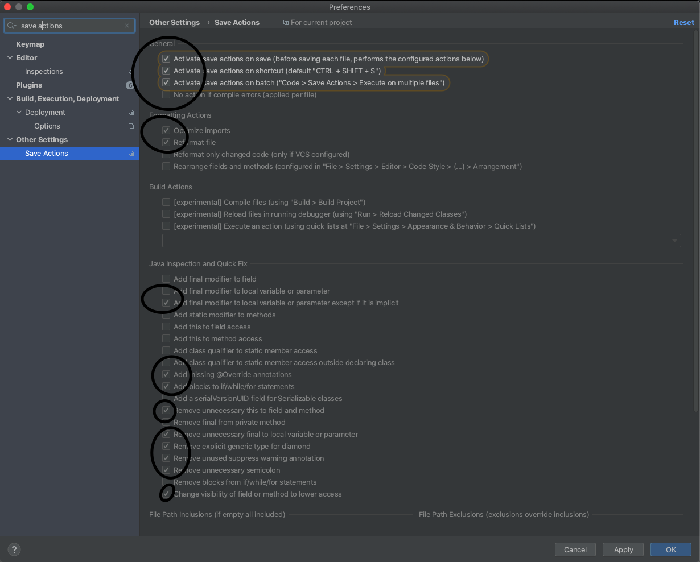
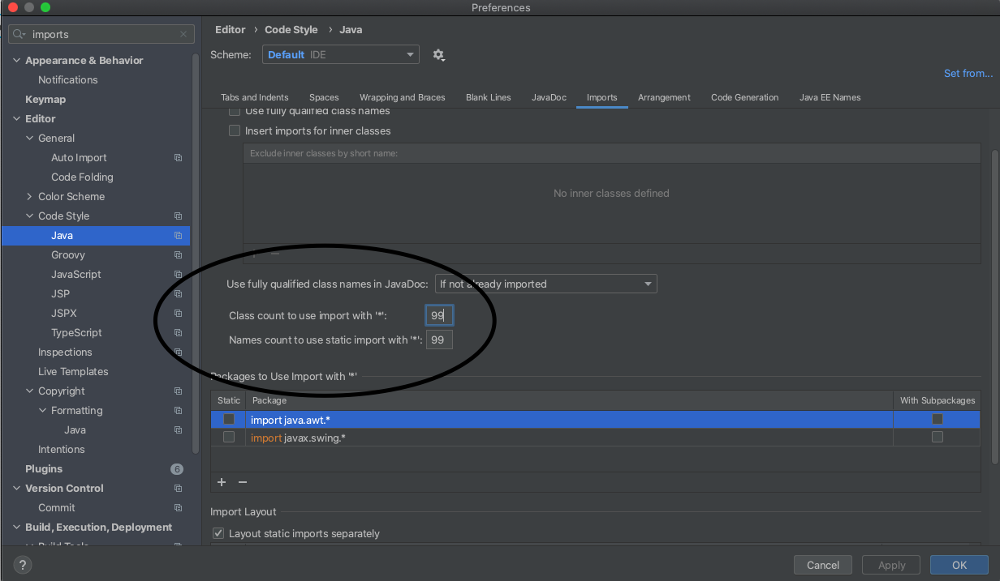

# IntelliJ Required Plugins:

All these plugins can be installed from IntelliJ itself in the plugins section. Just search for them in the plugin section and install them please:

- Lombok

    * It helps to avoid having to write getters, setters, equals, hashcode and toString methods for the POJOs(models).
    * If you don't add it to IntelliJ or Eclipse, the IDEs will show as compilation errors for some of the models that use it.
    * Here is a link with some of its features:

    - [Features](https://projectlombok.org/features/all)

- Maven Helper plugin

    * With this plugin when you open a pom.xml file you can see its dependencies (like commons-logging:1.2[provided] in this case), their version and their scope, and refresh them or import them if needed.

  

- Save Actions plugin

    * These are the settings you should have once installed:

  

    * Remember to also add this setting to avoid imports with * once Save Actions is setup:

   
    

